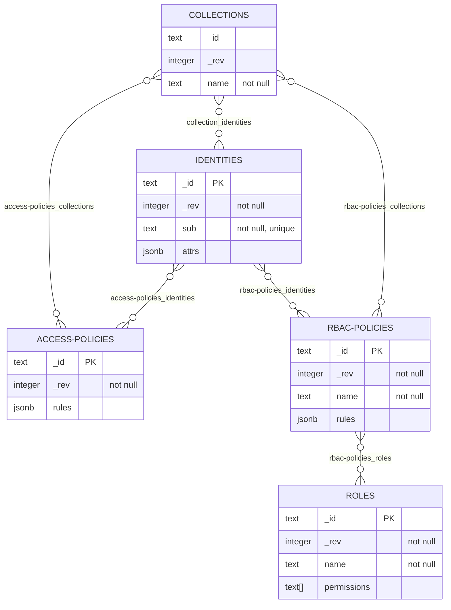
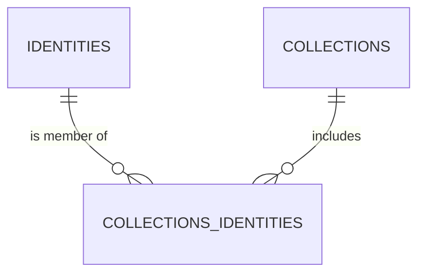
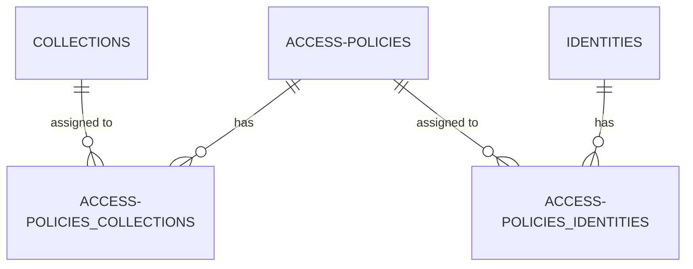
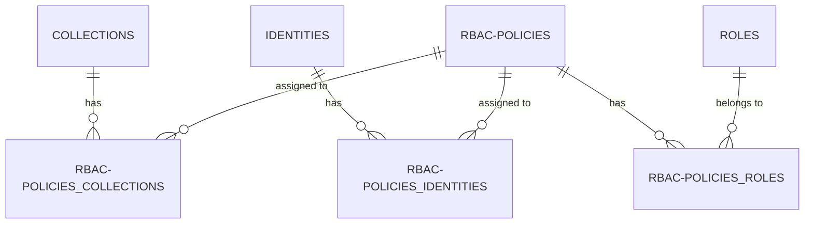

## Database diagram(s)

Database schema is defined in [`datastore/schema.sql`](../datastore/schema.sql).

### Overview
The diagram in this section includes the main tables in the gatekeeper database.The relationships between tables are many-to-many, with the junction table named on the connecting lines.

### Collection identities diagram

### Access Policies diagram

### RBAC policies diagram

