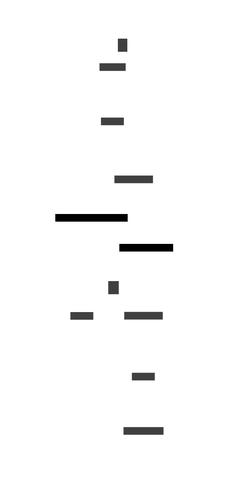

# ReBAC

You can use Relations-Based Access Control (ReBAC) to define and check fine-grained permissions between
entities as a relations graph. Relations graphs enable Sentium to derive implicit relations when there
aren't any direct relations.

For example, in the following relations graph there's no direct relation created between `user:jane`
and `doc:notes.txt`. But by examining the relations, Sentium can derive `user:jane -> reader -> doc:notes.txt`
relation.

## Relation Tuples

A relation, which is a connection between a left entity and a right entity, is represented by a _relation
tuple_. A relation tuple can be expressed using `'['⟨strand⟩']'⟨entity⟩'/'⟨relation⟩'/'⟨entity⟩` text
notation, where;

- `⟨strand⟩` is a _relation_ that links two tuples together which can be empty
- `⟨entity⟩` is a _principal_ or an outside entity with a _type_ and an _id_
- `⟨relation⟩` is a string describing the _relation_ between the two entities

| Text notation | Semantics |
| ------------- | --------- |
| `[]user:alice/member/team:writers`        | User `user:alice` is a _member_ of `team:writers`            |
| `[member]team:writers/edit/doc:notes.txt` | _Members_ of `team:writers` can _edit_ `doc:notes.txt`       |
| `[owner]folder:F/owner/doc:notes.txt`     | _Owners_ of `folder:F` are also _owners_ of `doc:notes.txt`  |
| `[]folder:F/parent/doc:notes.txt`         | Entity `folder:F` has a _parent_ relation to `doc:notes.txt` |

Two or more relation tuples can be linked (left to right) using a _strand_. To be able to link two tuples
and consider them to in a single relations chain,

1. First tuple's _right entity_ must match the second tuple's _left entity_ (`t1.right == t2.left`)
2. And, first tuple's _relation_ must match second tuple's _strand_ (`t1.relation == t2.strand`)

For example, `[]user:alice/member/team:writers` can be chained with `[member]team:writers/edit/doc:notes.txt`
but not with `[owner]team:writers/edit/doc:notes.txt` (since first tuple's _relation_, `member`, doesn't
match second tuple's _strand_, `owner`).

Example - Two tuples linked by a strand

